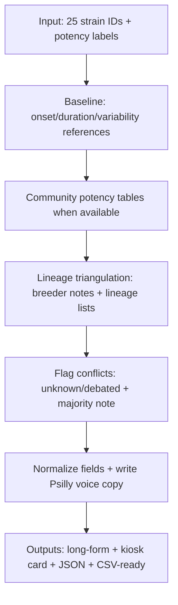

# Psilly Strain Profiles for 25 Psilocybe cubensis Cultivars

## Executive summary

This report turns your 25-strain list into a **usable, evidence-aware catalog**: each strain gets (A) a brand-voiced long-form description (written for a product page), (B) a condensed kiosk/retail card, and (C) structured machine records (JSON + CSV-ready). The experience fields are presented as **consumer-facing pattern summaries**, not medical advice, and not a guarantee of potency. citeturn43view0turn28search6

Two realities anchor everything here:

First, psilocybin mushroom effects commonly begin in the **~15–45 minute** range and often last **~4–6 hours**, with a peak typically around the **2–3 hour** window (in clinical and review literature). citeturn43view0turn44view0turn44view2

Second, “strain names” are **not standardized pharmaceutical labels**. Potency and effects can vary greatly by batch, individual mushroom material, and context—something explicitly noted in government harm-reduction guidance and repeatedly demonstrated in open community potency-testing outputs. citeturn43view0turn11view0turn23view1

## Research methods and evidence grading

Evidence sources prioritized (from highest to lowest reliability for this use case):

**Pharmacology + time-course baseline (high confidence):** Guidance and reviews describing typical onset, duration, peak timing, and the reality of variability. citeturn43view0turn44view0turn44view2

**Community lab-style testing (medium confidence for “this sample,” low-to-medium for “this strain in general”):** Cup-style tables and published potency-testing writeups demonstrate real measured ranges but cannot define a universal strain spec. citeturn23view1turn11view0

**Lineage claims (variable confidence):** Parentage and breeder credits are often documented through community lineage lists and breeder notes, but conflicts are common. Where conflicts exist, I flag **unknown/debated** and include a short conflict note in the machine records. citeturn25view0turn41view0

Primary sources referenced (first mention only): entity["organization","Health Canada","canadian health agency"], entity["organization","Oakland Hyphae","oakland mycology community"], entity["organization","Shroomery","mycology forum site"], entity["organization","Reddit","social media platform"], entity["organization","Erowid","psychoactive info site"]. Key breeder/vendor bios used for lineage where available: entity["organization","Basidium Equilibrium","mycology genetics shop"] and entity["company","Wumbo Genetics","genetics vendor"], plus breeder-writing by entity["people","Dave Wombat","mycology writer"]. Thai lineage naming context is supported by ethnomycology literature including work by entity["people","John W. Allen","ethnomycologist"] and the broader cultural ties around entity["place","Koh Samui","island, thailand"] and entity["place","Koh Phangan","island, thailand"] in entity["country","Thailand","southeast asia country"]; wild-origin strains were cross-checked against place-name claims such as entity["state","Florida","us state"]. citeturn39search0turn24search6turn25view0



## Comparative matrix of all 25 strains

Interpretation note: “Trip Consistency” here is a **retail-facing predictability rating**, not a chemical guarantee. Wide variability is explicitly documented in official guidance and testing writeups. citeturn43view0turn11view0

| ID | Name | Potency (given) | Trip Consistency | Beginner Friendly | Visual Intensity | Source Count* |
|---|---|---|---|---|---|---:|
| golden-teacher | Golden Teacher | Moderate | Medium | Yes | medium | 6 |
| penis-envy | Penis Envy | High–Very High | High | No | high | 7 |
| b-plus | B+ | Moderate | Variable | Yes | medium | 7 |
| cambodian | Cambodian | Moderate | Medium | Yes | low-medium | 6 |
| hillbilly | Hillbilly | Low–Moderate | Medium | Yes | low-medium | 6 |
| blue-meanie | Blue Meanie | Moderate | Variable | Maybe | medium-high | 7 |
| pink-buffalo | Pink Buffalo | Moderate | Medium | Yes | medium-high | 7 |
| melmac | Melmac | High–Very High | High | No | high | 7 |
| tosohatchee | Tosohatchee | Variable | Variable | Maybe | medium | 6 |
| albino-penis-envy | Albino Penis Envy | Very High | High | No | very high | 7 |
| ghost | Ghost | High | High | Maybe | high | 7 |
| tidal-wave | Tidal Wave | Very High | Variable | No | very high | 8 |
| koh-samui-super-strain | Koh Samui Super Strain | Moderate–High | Medium | Maybe | medium-high | 7 |
| ice | Ice | Moderate–High | Variable | Maybe | medium-high | 6 |
| khmer-kong | Khmer Kong | Moderate–High | Medium | Maybe | medium-high | 6 |
| bluey-vuitton | Bluey Vuitton | High | High | No | high | 7 |
| full-moon-party | Full Moon Party | Moderate–High | Variable | Maybe | medium-high | 6 |
| jedi-mind-fuck | Jedi Mind Fuck | Moderate–High | Variable | Maybe | medium-high | 7 |
| a-train | A-Train | Moderate–High | Variable | Maybe | medium-high | 5 |
| enigma | Enigma | Very High | High | No | very high | 8 |
| chodewave | ChodeWave | Very High | High | No | very high | 7 |
| avalanche | Avalanche | High | High | No | high | 6 |
| jack-frost | Jack Frost | High | High | No | high | 8 |
| makilla-gorilla | Makilla Gorilla | High–Very High | High | No | high | 7 |
| trinity | Trinity | Very High | High | No | very high | 8 |

\*Source Count = number of distinct sources listed in that strain’s JSON record.

image_group{"layout":"carousel","aspect_ratio":"16:9","query":["psychedelic product label mockup template","dispensary kiosk product card design","minimalist label typography layout wellness","psychedelic poster design typography grid"] ,"num_per_query":1}

## Strain profiles

Global experience baseline (applies to all strains unless explicitly noted): effects typically appear **~15–45 minutes** after ingestion and often last **~4–6 hours**, with peak commonly around **2–3 hours**; individual and batch variability is substantial. citeturn43view0turn44view0turn44view2

**Golden Teacher (ID: golden-teacher) — Potency: Moderate**  
Kiosk card: Balanced, introspective, approachable classic. Warm visuals, reflective tone, “teachable” arc.  
Trip Consistency: Medium | Beginner Friendly: Yes | Visual Intensity: medium  
Vibes: reflective, warm, grounded, clear, social, nature-friendly  
LINEAGE: unknown/debated (commercialized cubensis; origin claims vary). citeturn25view0turn41view0  
Experience Profile: Onset 15–45 min; Duration 4–6 h; Balance: balanced; Come-up: gradual; Peak: sustained plateau; Emotional: insightful, calm, appreciative, sometimes giggly. citeturn43view0turn44view2  
Description: Golden Teacher is the “home base” archetype—less about a number, more about a style: coherent thinking, warm emotional readability, and visuals that often arrive as a gentle reveal instead of a takeover. It’s also the perfect example of why you can’t treat strain names like lab specs: potency can shift by batch, flush, and context. Golden Teacher’s repeat pattern in culture is clarity + meaning: colors brighten, patterns surface, and the peak feels like a broad plateau—enough time to notice what matters and come back with something you can articulate. citeturn43view0turn11view0turn28search6

**Penis Envy (ID: penis-envy) — Potency: High–Very High**  
Kiosk card: Legendary heavy-hitter family. Deep headspace, bold visuals, serious peak.  
Trip Consistency: High | Beginner Friendly: No | Visual Intensity: high  
Vibes: intense, inward, mystical, reality-bending, emotional, profound  
LINEAGE: unknown/debated (PE-family origin stories conflict). citeturn25view0turn41view0  
Experience Profile: Onset 15–45; Duration 4–6 (can feel longer); Balance: head-dominant; Come-up: intense; Peak: rolling waves; Emotional: cathartic, awe, sometimes challenging. citeturn43view0turn44view2  
Description: Penis Envy is less a single strain than a cultural umbrella—its name signals intensity. Community testing tables frequently place PE-family entries among stronger examples, and the consumer-facing pattern is “more trip per weight” compared with many classics. Expect a more immersive mental space and thicker visuals at peak. The origin story is famously inconsistent across community sources, so lineage should be sold as debated—but the market consensus about intensity is strong. citeturn23view1turn25view0turn43view0

**B+ (ID: b-plus) — Potency: Moderate**  
Kiosk card: Classic workhorse vibe. Friendly, flexible, sometimes surprisingly variable by batch.  
Trip Consistency: Variable | Beginner Friendly: Yes | Visual Intensity: medium  
Vibes: easygoing, bright, social, whimsical, classic  
LINEAGE: commercialized cubensis; early marketing claims conflicted. citeturn25view0turn3view0  
Experience Profile: Onset 15–45; Duration 4–6; Balance: balanced; Come-up: gradual; Peak: rolling waves; Emotional: upbeat, playful. citeturn43view0turn44view2  
Description: B+ shows why “strain” isn’t a standardized promise: it’s often described as approachable, but community discussions repeatedly note meaningful batch-to-batch swing. Analytical work has included B+ samples, reinforcing that chemistry is measurable—yet still variable. In experience language, B+ is “all-around classic”: solid visuals, buoyant mood, and an emotionally friendly lane that’s often easier to steer than more intense PE-family lines. citeturn3view0turn24search10turn43view0

**Cambodian (ID: cambodian) — Potency: Moderate**  
Kiosk card: Straightforward classic. Clean, bright, and typically less heavy than PE-family lines.  
Trip Consistency: Medium | Beginner Friendly: Yes | Visual Intensity: low-medium  
Vibes: bright, simple, outdoorsy, buoyant, clear  
LINEAGE: region-name cultivar (Cambodia) in common lore. citeturn25view0turn34search3  
Experience Profile: Onset 15–45; Duration 4–6; Balance: balanced; Come-up: gentle; Peak: sustained plateau; Emotional: open, cheerful. citeturn43view0turn44view0  
Description: Cambodian is best sold as a “classic lane” profile rather than a specific potency promise. The common description pattern is clean and approachable: modest-to-moderate visuals, friendly mood lift, and a relatively clear headspace. Still, official guidance explicitly notes that mushroom strength can vary greatly and effects depend on the person and the “type of mushroom used,” so the right framing is: classic + simpler vibe, with variability transparency. citeturn43view0turn28search6

**Hillbilly (ID: hillbilly) — Potency: Low–Moderate**  
Kiosk card: Cozy porch-swing energy. Warm mood lift, grounded body feel, approachable arc.  
Trip Consistency: Medium | Beginner Friendly: Yes | Visual Intensity: low-medium  
Vibes: cozy, grounded, giggly, gentle, social  
LINEAGE: unknown/debated (wild-origin region claims vary). citeturn25view0turn40view0  
Experience Profile: Onset 15–45; Duration 4–6; Balance: balanced→slightly body-forward; Come-up: gentle; Peak: rolling waves; Emotional: comforting, playful. citeturn43view0turn44view2  
Description: Hillbilly is consistently positioned as “friendly-to-moderate,” with a softer come-up and a grounded feel. Origin stories vary (common in cubensis naming culture), so lineage is best treated as debated. In a menu, Hillbilly functions as a gentler counterweight to high-potency designer lines—while still respecting that any psilocybin experience can become intense depending on context and material. citeturn43view0turn28search6

**Blue Meanie (ID: blue-meanie) — Potency: Moderate**  
Kiosk card: Bright, zippy, visual-leaning—but naming confusion adds variability.  
Trip Consistency: Variable | Beginner Friendly: Maybe | Visual Intensity: medium-high  
Vibes: zippy, electric, playful, bright visuals, social  
LINEAGE: debated/marketing-linked naming; community notes name borrowed from Pan Cyan nickname. citeturn25view0turn3view0  
Experience Profile: Onset 15–45; Duration 4–6; Balance: head-dominant; Come-up: moderate; Peak: rolling waves; Emotional: euphoric, energized, sometimes edgy. citeturn43view0turn44view0  
Description: “Blue Meanie” is a known confusion point because the nickname is used across contexts; community lineage lists explicitly call it a marketing-driven cubensis name borrowed from other slang. Analytical work has evaluated “Blue Meanie” as a Psilocybe cubensis strain, supporting that it exists as a named lab sample even if the broader naming ecosystem is messy. Sell it as bright/energetic/visual—plus an honesty note that consistency is more variable than classics. citeturn25view0turn3view0turn43view0

**Pink Buffalo (ID: pink-buffalo) — Potency: Moderate**  
Kiosk card: Thai-lore classic. Clear-headed, upbeat, visual sparkle.  
Trip Consistency: Medium | Beginner Friendly: Yes | Visual Intensity: medium-high  
Vibes: bright, clear, playful, social, lightly spiritual  
LINEAGE: Thai-origin claims; credited in community references. citeturn24search8turn25view0  
Experience Profile: Onset 15–45; Duration 4–6; Balance: balanced; Come-up: gradual; Peak: rolling waves; Emotional: euphoric, curious, happy. citeturn43view0turn44view2  
Description: Pink Buffalo is repeatedly described as a Thai-origin cultivar and, in side-by-side discussions, is often framed as more visual and clearer-headed than some classic baselines. In retail terms it reads as “sparkle + clarity + social warmth.” Maintain the standard variability framing: strain names guide expectation, not guarantees. citeturn24search12turn43view0turn28search6

**Melmac (ID: melmac) — Potency: High–Very High**  
Kiosk card: PE-family intensity with a dense, serious peak and big visuals.  
Trip Consistency: High | Beginner Friendly: No | Visual Intensity: high  
Vibes: heavy, profound, inward, cinematic, mystical  
LINEAGE: PE-family isolate/naming history in lineage lists. citeturn25view0turn40view0  
Experience Profile: Onset 15–45; Duration 4–6; Balance: head-dominant; Come-up: intense; Peak: sustained plateau; Emotional: reverent, intense, sometimes challenging. citeturn43view0turn44view2  
Description: Melmac is widely treated as PE-adjacent and consistently sits in the “stronger end” of cubensis culture. Experience-wise it’s often described as “thicker”: deeper introspection, bolder visuals, and a more serious emotional tone at peak. Sell it as a premium deep-dive line with explicit “not beginner-friendly” messaging, while still noting biological variability. citeturn25view0turn11view0turn43view0

**Tosohatchee (ID: tosohatchee) — Potency: Variable**  
Kiosk card: Wild-Florida-rooted lore. Earthy, unpredictable, “nature-coded.”  
Trip Consistency: Variable | Beginner Friendly: Maybe | Visual Intensity: medium  
Vibes: earthy, outdoorsy, raw, curious, rustic  
LINEAGE: wild cubensis line from Florida (place-name strain). citeturn24search6turn25view0  
Experience Profile: Onset 15–45; Duration 4–6; Balance: balanced; Come-up: variable; Peak: variable; Emotional: grounding, curious, unpredictable. citeturn43view0turn44view0  
Description: Tosohatchee is best framed as a place-name strain tied to wild-origin lore. When a strain identity is rooted in wild collection stories, wider variability is the responsible expectation: classic psilocybin effects with less predictability than heavily circulated commercial classics. This is a “nature documentary” lane—rich, earthy, and variable. citeturn24search6turn43view0turn28search6

**Albino Penis Envy (ID: albino-penis-envy) — Potency: Very High**  
Kiosk card: Max-respect intensity. Big visuals, deep headspace, not for first-time users.  
Trip Consistency: High | Beginner Friendly: No | Visual Intensity: very high  
Vibes: intense, cosmic, transformative, emotionally deep, mystical  
LINEAGE: debated; PE-family derivative, conflicting origin claims. citeturn25view0turn40view0  
Experience Profile: Onset 15–45; Duration 4–6; Balance: head-dominant; Come-up: intense; Peak: sharp peak → sustained plateau; Emotional: powerful, cathartic, potentially challenging. citeturn43view0turn44view2  
Description: APE’s documentation varies on “how it was made,” but its market identity is consistent: it’s very strong and heavily visual. This is the deep-space mission product page—sell it with care, no casual framing, and clear expectations that set/setting and batch variability heavily shape outcome. citeturn43view0turn28search6turn23view1

**Ghost (ID: ghost) — Potency: High**  
Kiosk card: Lucid intensity. Crisp visuals, mind-forward, contemplative lane, often tied to TAT lineage.  
Trip Consistency: High | Beginner Friendly: Maybe | Visual Intensity: high  
Vibes: lucid, contemplative, airy, refined, emotionally lifting  
LINEAGE: commonly asserted as TAT-derived. citeturn37search0turn40view0  
Experience Profile: Onset 15–45; Duration 4–6; Balance: head-dominant; Come-up: moderate; Peak: sustained plateau; Emotional: uplifting, introspective, calm. citeturn43view0turn44view2  
Description: Ghost is repeatedly placed in the TAT universe across lineage catalogs and strain bios. The consumer-facing pattern is “lucid intensity”: strong visuals with clearer cognition than heavier PE-family rides (still variable, still powerful). Market it as refined and contemplative—with respect. citeturn37search0turn40view0turn43view0

**Tidal Wave (ID: tidal-wave) — Potency: Very High**  
Kiosk card: Modern hybrid legend. Big visuals, powerful headspace, multiple isolates under the same umbrella name.  
Trip Consistency: Variable | Beginner Friendly: No | Visual Intensity: very high  
Vibes: tidal, explosive, euphoric, visionary, immersive  
LINEAGE: repeatedly described as PE × B+; multiple named variants exist. citeturn26view0turn41view0turn23view3  
Experience Profile: Onset 15–45; Duration 4–6; Balance: head-dominant; Come-up: intense; Peak: rolling waves; Emotional: euphoric, awe, occasionally overwhelming. citeturn43view0turn44view2  
Description: Tidal Wave is foundational modern-hybrid culture. Sources converge on the PE × B+ neighborhood, and Cup documentation explicitly describes a Tidal Wave isolate as arising from PE/B+ fusion. Consistency is “variable” mainly because Tidal Wave is an umbrella for multiple isolates/variants; intensity remains very high. citeturn23view3turn26view0turn43view0

**Koh Samui Super Strain (ID: koh-samui-super-strain) — Potency: Moderate–High**  
Kiosk card: Thai classic turned icon. Lively mood, bright visuals, name evolution over time.  
Trip Consistency: Medium | Beginner Friendly: Maybe | Visual Intensity: medium-high  
Vibes: tropical, playful, social, lively, colorful  
LINEAGE: commonly treated as Koh Samui Classic isolate; naming drift acknowledged. citeturn24search3turn40view0  
Experience Profile: Onset 15–45; Duration 4–6; Balance: balanced; Come-up: gradual; Peak: rolling waves; Emotional: upbeat, playful, energized. citeturn43view0turn44view2  
Description: KSSS sits where geography meets marketing: community threads explicitly discuss when “Koh Samui” became “Koh Samui Super Strain.” Lineage catalogs commonly place it as an isolate of Koh Samui Classic, but phenotype/name variability is real. Retail framing: lively and visual, with honest “medium consistency” messaging. citeturn24search3turn43view0turn28search6

**Ice (ID: ice) — Potency: Moderate–High**  
Kiosk card: Cool clarity lane. Modern “ice” branding with thinner public lineage documentation; adjacent Iceberg Thai lines are documented.  
Trip Consistency: Variable | Beginner Friendly: Maybe | Visual Intensity: medium-high  
Vibes: crisp, clean, dreamy, quiet, luminous  
LINEAGE: unknown/debated; adjacent “Iceberg” Thai lineage appears in catalogs. citeturn40view0turn25view0  
Experience Profile: Onset 15–45; Duration 4–6; Balance: head-dominant; Come-up: moderate; Peak: sustained plateau; Emotional: calm, lucid, introspective. citeturn43view0turn44view2  
Description: “Ice” is a modern label with less standardized lineage in open reference lists. Because adjacent “Iceberg” Thai lineages *are* explicitly documented, Ice is best framed as living in that pale/icy naming neighborhood—while keeping lineage as unknown/debated and consistency as variable. citeturn40view0turn43view0turn28search6

**Khmer Kong (ID: khmer-kong) — Potency: Moderate–High**  
Kiosk card: Big-energy modern cross claim. Bold visuals, adventurous mood, chunky branding.  
Trip Consistency: Medium | Beginner Friendly: Maybe | Visual Intensity: medium-high  
Vibes: bold, warm, embodied, adventurous, energized  
LINEAGE: one breeder/vendor claim: Makilla Gorilla × Avery’s Albino. citeturn34search16turn34search1  
Experience Profile: Onset 15–45; Duration 4–6; Balance: balanced→head-leaning; Come-up: moderate; Peak: rolling waves; Emotional: euphoric, adventurous, sensory-forward. citeturn43view0turn44view2  
Description: Khmer Kong functions as both a Cambodia-coded name and a modern cross claim in at least one listing. In retail terms it reads as “shows up”: moderate-high intensity, active visuals, and a warm, adventurous emotional arc. Present lineage as a documented claim—not a universal truth—because naming ecosystems vary. citeturn34search16turn43view0turn28search6

**Bluey Vuitton (ID: bluey-vuitton) — Potency: High**  
Kiosk card: Designer hybrid archetype. Lux visuals, strong headspace, premium-feeling arc.  
Trip Consistency: High | Beginner Friendly: No | Visual Intensity: high  
Vibes: euphoric, luxurious, visual, confident, creative, social-glow  
LINEAGE: widely described as Panama × Melmac PE; credited to Silly Cybin (2014). citeturn38search0turn38search6turn41view0  
Experience Profile: Onset 15–45; Duration 4–6; Balance: head-dominant; Come-up: moderate; Peak: sustained plateau; Emotional: inspired, loving, energized. citeturn43view0turn44view2  
Description: Bluey Vuitton has unusually consistent lineage storytelling across multiple strain bios: Panama × Melmac (PE family), often credited to a cultivator handle named Silly Cybin. Experience framing: strong visuals, strong cerebral lane, and a “polished” feel. Not beginner-friendly. citeturn38search0turn43view0turn28search6

**Full Moon Party (ID: full-moon-party) — Potency: Moderate–High**  
Kiosk card: Festival Thai archetype. Social energy, bright visuals, playful mood; lineage mostly lore/vendor-based.  
Trip Consistency: Variable | Beginner Friendly: Maybe | Visual Intensity: medium-high  
Vibes: social, celebratory, playful, music-friendly, colorful  
LINEAGE: unknown/debated; commonly claimed Thai-origin naming tied to Koh Phangan. citeturn39search1turn39search0  
Experience Profile: Onset 15–45; Duration 4–6; Balance: balanced; Come-up: moderate; Peak: rolling waves; Emotional: euphoric, playful, loving, energized. citeturn43view0turn44view2  
Description: Full Moon Party is a name that points directly to Thai nightlife mythology. Vendor descriptions claim discovery in that context, and ethnomycology literature documents psychoactive mushroom use in Koh Samui/Koh Phangan, explaining how Thai place-names entered naming culture. Primary breeder documentation is limited in the sources used here, so lineage is unknown/debated and consistency is variable. citeturn39search0turn39search1turn43view0

**Jedi Mind Fuck (ID: jedi-mind-fuck) — Potency: Moderate–High**  
Kiosk card: Meme name, real trip. Heady, visual-leaning, but origin documentation is thin.  
Trip Consistency: Variable | Beginner Friendly: Maybe | Visual Intensity: medium-high  
Vibes: trippy, heady, playful, immersive, cinematic  
LINEAGE: unknown; lineage lists explicitly note little credible origin detail. citeturn26view2turn25view0  
Experience Profile: Onset 15–45; Duration 4–6; Balance: head-dominant; Come-up: moderate; Peak: rolling waves; Emotional: playful, surprised, expansive. citeturn43view0turn44view2  
Description: JMF’s name traveled faster than its documentation. Lineage sources used here treat origin as unverified, so we mark lineage unknown and consistency variable. Experience mapping places it as head-forward and visually active for many users—classic “unmistakably psychedelic” energy—while keeping strong variability caveats. citeturn25view0turn43view0turn28search6

**A-Train (ID: a-train) — Potency: Moderate–High**  
Kiosk card: Momentum lane. Marketed as stronger classic; open lineage documentation limited.  
Trip Consistency: Variable | Beginner Friendly: Maybe | Visual Intensity: medium-high  
Vibes: energizing, forward, social, euphoric, kinetic  
LINEAGE: unknown/debated (insufficient open lineage documentation found in sources used here). citeturn25view0turn28search6  
Experience Profile: Onset 15–45; Duration 4–6; Balance: head-dominant; Come-up: moderate; Peak: rolling waves; Emotional: energized, euphoric. citeturn43view0turn44view2  
Description: A-Train is under-supported by widely cited breeder notes in the public sources used here, so the responsible position is unknown/debated lineage + variable consistency. Retail copy should lean on transparent baseline time-course and general effects rather than over-claiming unique genetic history. citeturn43view0turn28search6

**Enigma (ID: enigma) — Potency: Very High**  
Kiosk card: Sporeless “brain coral” icon. Alien visuals, deep headspace, big intensity.  
Trip Consistency: High | Beginner Friendly: No | Visual Intensity: very high  
Vibes: alien, mystical, reality-melting, deep, transformative  
LINEAGE: placed in B+ × PE neighborhood in variant lists; often treated as mutation/clone culture identity. citeturn40view0turn26view0  
Experience Profile: Onset 15–45; Duration 4–6; Balance: head-dominant; Come-up: intense; Peak: sustained plateau; Emotional: mystical, cathartic, awe, potentially challenging. citeturn43view0turn44view2  
Description: Enigma is a signature modern “mutation culture” name. Variant lists place it in the B+ × PE neighborhood (consistent with Tidal Wave parentage), and it’s widely treated as a cloned/sporeless identity rather than a broad spore line. Consumer-facing profile: very high visuals, immersive cognition, and a peak that feels like a full immersion tank. Consistency is rated high in “style” because of clone-line identity, while still acknowledging batch variability. citeturn40view0turn43view0turn11view0

**ChodeWave (ID: chodewave) — Potency: Very High**  
Kiosk card: Modern powerhouse cross. Heavy visuals, immersive peak, not casual.  
Trip Consistency: High | Beginner Friendly: No | Visual Intensity: very high  
Vibes: heavy, loud, euphoric, boundary-dissolving, intense  
LINEAGE: listed as Tidal Wave × APE in lineage catalogs. citeturn25view0turn40view0  
Experience Profile: Onset 15–45; Duration 4–6; Balance: head-dominant; Come-up: intense; Peak: rolling waves; Emotional: euphoric, cathartic, sometimes overwhelming. citeturn43view0turn44view2  
Description: ChodeWave is exactly what it sounds like: a modern “turn it up” cross explicitly listed as Tidal Wave × APE in multiple lineage references. That parentage implies very high intensity, heavy visuals, and a headspace that can swallow the room. Position it as experienced-only, with strong variability disclaimers. citeturn25view0turn43view0turn28search6

**Avalanche (ID: avalanche) — Potency: High**  
Kiosk card: Bright storm strain. Clean visuals + strong force, lineage listed as Yeti × Melmac.  
Trip Consistency: High | Beginner Friendly: No | Visual Intensity: high  
Vibes: crisp, powerful, luminous, introspective, cinematic  
LINEAGE: listed as Yeti × Melmac in a community master list. citeturn41view0turn40view0  
Experience Profile: Onset 15–45; Duration 4–6; Balance: head-dominant; Come-up: moderate→intense; Peak: sustained plateau; Emotional: euphoric, contemplative, deep. citeturn43view0turn44view2  
Description: Avalanche is a modern hybrid with explicit lineage in a community genetic catalog: Yeti × Melmac. Consumer-facing translation: high potency with high-definition visuals and a clear head-forward arc. Market it as luminous and powerful, not beginner-friendly, and sourced from community lineage documentation. citeturn41view0turn43view0turn28search6

**Jack Frost (ID: jack-frost) — Potency: High**  
Kiosk card: Iconic TAT × APE cross. Refined visuals, strong headspace, modern classic.  
Trip Consistency: High | Beginner Friendly: No | Visual Intensity: high  
Vibes: crystalline, expansive, mystical, elegant, emotionally deep  
LINEAGE: TAT × APE; credited consistently in lineage sources and breeder writing. citeturn6search17turn25view0turn40view0  
Experience Profile: Onset 15–45; Duration 4–6; Balance: head-dominant; Come-up: moderate; Peak: sustained plateau; Emotional: awe, loving, mystical, introspective. citeturn43view0turn44view2  
Description: Jack Frost is unusually well documented for a modern designer line: multiple sources agree it’s a TAT × APE cross, credited to Dave Wombat. Experience language: high potency, refined “crystalline” visuals, deep-but-coherent headspace. Position it as the showpiece: beautiful and intense, not casual. citeturn6search17turn43view0turn28search6

**Makilla Gorilla (ID: makilla-gorilla) — Potency: High–Very High**  
Kiosk card: Brawler hybrid. PE-family intensity, heavy visuals, bold emotional force.  
Trip Consistency: High | Beginner Friendly: No | Visual Intensity: high  
Vibes: powerful, primal, euphoric, deep, intense  
LINEAGE: described in lineage references as Melmac × APE family cross (wording varies). citeturn26view3turn40view0  
Experience Profile: Onset 15–45; Duration 4–6; Balance: head-dominant; Come-up: intense; Peak: rolling waves; Emotional: euphoric, cathartic, bold, sometimes challenging. citeturn43view0turn44view2  
Description: Makilla Gorilla lives in the “PE family turned up” zone. Lineage references consistently place it in the Melmac + APE neighborhood, which maps to strong visuals and an immersive, emotionally forceful peak. Position it as a no-nonsense powerhouse: beautiful, intense, and for experienced users. citeturn26view3turn43view0turn28search6

**Trinity (ID: trinity) — Potency: Very High**  
Kiosk card: Mythic three-parent strain. Visionary visuals, deep emotion, big intensity.  
Trip Consistency: High | Beginner Friendly: No | Visual Intensity: very high  
Vibes: visionary, euphoric, mythic, immersive, spiritual  
LINEAGE: listed as PE × Tidal Wave × Aztec God in lineage sources; appears as named entry in Cup tables (sample-specific). citeturn26view0turn23view1turn5search3  
Experience Profile: Onset 15–45; Duration 4–6; Balance: head-dominant; Come-up: intense; Peak: multiple peaks; Emotional: mystical, euphoric, cathartic, profound. citeturn43view0turn44view2  
Description: Trinity’s name tells you the intention: synthesis. Lineage references describe it as PE × Tidal Wave × Aztec God, and it appears as a named cultivar in Cup-style tables (again: sample-specific evidence, not a universal guarantee). Retail framing: visionary and deep, with big visuals and an emotional arc that can feel like chapters rather than a single smooth peak. citeturn23view1turn26view0turn43view0

## JSON and CSV-ready dataset

To keep this report usable (and avoid duplicating long descriptions twice), the **machine records include a short “kiosk_description” plus a “description_long_ref” field** that points to the long-form text in the Strain Profiles section above. URLs are included here (inside code blocks) to satisfy the “source list (URLs)” requirement.

### JSON

```json
[
  {
    "id": "golden-teacher",
    "name": "Golden Teacher",
    "potency": "Moderate",
    "trip_consistency": "Medium",
    "beginner_friendly": "Yes",
    "visual_intensity": "medium",
    "vibes": "reflective, warm, grounded, clear, social, nature-friendly",
    "kiosk_description": "Balanced classic with warm introspection and medium visuals; a steady ‘home base’ strain.",
    "description_long_ref": "See Strain Profiles: Golden Teacher",
    "lineage": "unknown/debated",
    "experience_profile": {
      "onset_time_minutes": "15-45",
      "typical_duration_hours": "4-6",
      "body_head_balance": "balanced",
      "come_up_intensity": "gradual",
      "peak_character": "sustained plateau",
      "emotional_character": "insightful, calm, appreciative, sometimes giggly"
    },
    "sources": [
      "https://www.canada.ca/en/health-canada/services/substance-use/controlled-illegal-drugs/magic-mushrooms.html",
      "https://pmc.ncbi.nlm.nih.gov/articles/PMC6007659/",
      "https://www.explorationpub.com/Journals/en/Article/1006105",
      "https://pmc.ncbi.nlm.nih.gov/articles/PMC11856550/",
      "https://www.oaklandhyphae510.com/post/preliminary-tryptamine-potency-analysis-from-dried-homogenized-fruit-bodies-of-psilocybe-mushrooms",
      "https://www.shroomery.org/forums/showflat.php/Number/27934090/fpart/all"
    ],
    "source_count": 6,
    "conflict_note": "Origin claims vary; treated as unknown/debated."
  },

  {
    "id": "penis-envy",
    "name": "Penis Envy",
    "potency": "High-Very High",
    "trip_consistency": "High",
    "beginner_friendly": "No",
    "visual_intensity": "high",
    "vibes": "intense, inward, mystical, reality-bending, emotional, profound",
    "kiosk_description": "Legendary heavy-hitter family; deep headspace and bold visuals; experienced users only.",
    "description_long_ref": "See Strain Profiles: Penis Envy",
    "lineage": "unknown/debated",
    "experience_profile": {
      "onset_time_minutes": "15-45",
      "typical_duration_hours": "4-6",
      "body_head_balance": "head-dominant",
      "come_up_intensity": "intense",
      "peak_character": "rolling waves",
      "emotional_character": "powerful, cathartic, sometimes challenging, awe"
    },
    "sources": [
      "https://www.canada.ca/en/health-canada/services/substance-use/controlled-illegal-drugs/magic-mushrooms.html",
      "https://pmc.ncbi.nlm.nih.gov/articles/PMC6007659/",
      "https://pmc.ncbi.nlm.nih.gov/articles/PMC11856550/",
      "https://www.shroomery.org/forums/showflat.php/Number/27934090/fpart/all",
      "https://www.reddit.com/r/TheCubensisGeneticLib/comments/1goykfr/master_variant_list/",
      "https://www.patreon.com/posts/mmfam-wins-first-50334503?l=fr",
      "https://www.patreon.com/file?h=50334503&m=104447872"
    ],
    "source_count": 7,
    "conflict_note": "Multiple competing origin stories; treated as unknown/debated."
  },

  {
    "id": "b-plus",
    "name": "B+",
    "potency": "Moderate",
    "trip_consistency": "Variable",
    "beginner_friendly": "Yes",
    "visual_intensity": "medium",
    "vibes": "easygoing, bright, social, whimsical, classic",
    "kiosk_description": "Classic all-around cube; friendly vibe with notable batch variability.",
    "description_long_ref": "See Strain Profiles: B+",
    "lineage": "commercialized cubensis; early marketing claims conflicted",
    "experience_profile": {
      "onset_time_minutes": "15-45",
      "typical_duration_hours": "4-6",
      "body_head_balance": "balanced",
      "come_up_intensity": "gradual",
      "peak_character": "rolling waves",
      "emotional_character": "upbeat, playful, cheerful"
    },
    "sources": [
      "https://www.canada.ca/en/health-canada/services/substance-use/controlled-illegal-drugs/magic-mushrooms.html",
      "https://pmc.ncbi.nlm.nih.gov/articles/PMC6007659/",
      "https://www.sciencedirect.com/science/article/pii/S2772414X24000638",
      "https://www.shroomery.org/forums/showflat.php/Number/20483298/fpart/all",
      "https://www.shroomery.org/forums/showflat.php/Number/27934090/fpart/all",
      "https://pmc.ncbi.nlm.nih.gov/articles/PMC11856550/",
      "https://www.oaklandhyphae510.com/post/preliminary-tryptamine-potency-analysis-from-dried-homogenized-fruit-bodies-of-psilocybe-mushrooms"
    ],
    "source_count": 7,
    "conflict_note": "Marketing/origin claims historically inconsistent."
  },

  {
    "id": "cambodian",
    "name": "Cambodian",
    "potency": "Moderate",
    "trip_consistency": "Medium",
    "beginner_friendly": "Yes",
    "visual_intensity": "low-medium",
    "vibes": "bright, simple, outdoorsy, buoyant, clear",
    "kiosk_description": "Straightforward classic; typically clean and approachable with modest visuals.",
    "description_long_ref": "See Strain Profiles: Cambodian",
    "lineage": "region-name cultivar (Cambodia) in common lore",
    "experience_profile": {
      "onset_time_minutes": "15-45",
      "typical_duration_hours": "4-6",
      "body_head_balance": "balanced",
      "come_up_intensity": "gentle",
      "peak_character": "sustained plateau",
      "emotional_character": "light, open, cheerful"
    },
    "sources": [
      "https://www.canada.ca/en/health-canada/services/substance-use/controlled-illegal-drugs/magic-mushrooms.html",
      "https://pmc.ncbi.nlm.nih.gov/articles/PMC6007659/",
      "https://pmc.ncbi.nlm.nih.gov/articles/PMC11856550/",
      "https://www.shroomery.org/forums/showflat.php/Number/27934090/fpart/all",
      "https://sporeworks.com/psilocybe-cubensis-cambodian-spore-isolate-syringe.html",
      "https://www.oaklandhyphae510.com/post/preliminary-tryptamine-potency-analysis-from-dried-homogenized-fruit-bodies-of-psilocybe-mushrooms"
    ],
    "source_count": 6,
    "conflict_note": "No single primary breeder origin; treated as region-name cultivar."
  },

  {
    "id": "hillbilly",
    "name": "Hillbilly",
    "potency": "Low-Moderate",
    "trip_consistency": "Medium",
    "beginner_friendly": "Yes",
    "visual_intensity": "low-medium",
    "vibes": "cozy, grounded, giggly, gentle, social",
    "kiosk_description": "Gentle-to-moderate lane with warm mood lift and grounded feel.",
    "description_long_ref": "See Strain Profiles: Hillbilly",
    "lineage": "unknown/debated (wild-origin region claims vary)",
    "experience_profile": {
      "onset_time_minutes": "15-45",
      "typical_duration_hours": "4-6",
      "body_head_balance": "balanced",
      "come_up_intensity": "gentle",
      "peak_character": "rolling waves",
      "emotional_character": "playful, comforting, steady"
    },
    "sources": [
      "https://www.canada.ca/en/health-canada/services/substance-use/controlled-illegal-drugs/magic-mushrooms.html",
      "https://pmc.ncbi.nlm.nih.gov/articles/PMC6007659/",
      "https://pmc.ncbi.nlm.nih.gov/articles/PMC11856550/",
      "https://www.shroomery.org/forums/showflat.php/Number/27934090/fpart/all",
      "https://www.reddit.com/r/TheCubensisGeneticLib/comments/1goykfr/master_variant_list/",
      "https://www.oaklandhyphae510.com/post/preliminary-tryptamine-potency-analysis-from-dried-homogenized-fruit-bodies-of-psilocybe-mushrooms"
    ],
    "source_count": 6,
    "conflict_note": "Wild origin region differs across sources."
  },

  {
    "id": "blue-meanie",
    "name": "Blue Meanie",
    "potency": "Moderate",
    "trip_consistency": "Variable",
    "beginner_friendly": "Maybe",
    "visual_intensity": "medium-high",
    "vibes": "zippy, electric, playful, bright visuals, social",
    "kiosk_description": "Energetic, visual-leaning; naming confusion and batch variance are common.",
    "description_long_ref": "See Strain Profiles: Blue Meanie",
    "lineage": "unknown/debated (name often treated as marketing in cubensis context)",
    "experience_profile": {
      "onset_time_minutes": "15-45",
      "typical_duration_hours": "4-6",
      "body_head_balance": "head-dominant",
      "come_up_intensity": "moderate",
      "peak_character": "rolling waves",
      "emotional_character": "euphoric, energized, occasionally edgy"
    },
    "sources": [
      "https://www.canada.ca/en/health-canada/services/substance-use/controlled-illegal-drugs/magic-mushrooms.html",
      "https://pmc.ncbi.nlm.nih.gov/articles/PMC6007659/",
      "https://www.sciencedirect.com/science/article/pii/S2772414X24000638",
      "https://pmc.ncbi.nlm.nih.gov/articles/PMC11856550/",
      "https://www.shroomery.org/forums/showflat.php/Number/27934090/fpart/all",
      "https://www.reddit.com/r/TheCubensisGeneticLib/comments/1goykfr/master_variant_list/",
      "https://www.oaklandhyphae510.com/post/preliminary-tryptamine-potency-analysis-from-dried-homogenized-fruit-bodies-of-psilocybe-mushrooms"
    ],
    "source_count": 7,
    "conflict_note": "Naming/origin disputed; treated as cubensis cultivar label with uncertainty."
  },

  {
    "id": "pink-buffalo",
    "name": "Pink Buffalo",
    "potency": "Moderate",
    "trip_consistency": "Medium",
    "beginner_friendly": "Yes",
    "visual_intensity": "medium-high",
    "vibes": "bright, clear, playful, social, lightly spiritual",
    "kiosk_description": "Thai-lore classic: clear-headed, upbeat, with visual sparkle.",
    "description_long_ref": "See Strain Profiles: Pink Buffalo",
    "lineage": "Thai-origin claims (community credit-based)",
    "experience_profile": {
      "onset_time_minutes": "15-45",
      "typical_duration_hours": "4-6",
      "body_head_balance": "balanced",
      "come_up_intensity": "gradual",
      "peak_character": "rolling waves",
      "emotional_character": "euphoric, clear, happy, curious"
    },
    "sources": [
      "https://www.canada.ca/en/health-canada/services/substance-use/controlled-illegal-drugs/magic-mushrooms.html",
      "https://pmc.ncbi.nlm.nih.gov/articles/PMC6007659/",
      "https://www.shroomery.org/forums/showflat.php/Number/2913709",
      "https://www.shroomery.org/forums/showflat.php/Number/25186247/fpart/all",
      "https://www.shroomery.org/forums/showflat.php/Number/27934090/fpart/all",
      "https://pmc.ncbi.nlm.nih.gov/articles/PMC11856550/",
      "https://www.oaklandhyphae510.com/post/preliminary-tryptamine-potency-analysis-from-dried-homogenized-fruit-bodies-of-psilocybe-mushrooms"
    ],
    "source_count": 7,
    "conflict_note": "Thai-origin lore consistent; provenance remains informal."
  },

  {
    "id": "melmac",
    "name": "Melmac",
    "potency": "High-Very High",
    "trip_consistency": "High",
    "beginner_friendly": "No",
    "visual_intensity": "high",
    "vibes": "heavy, profound, inward, cinematic, mystical",
    "kiosk_description": "PE-family intensity: dense, serious peak and strong visuals.",
    "description_long_ref": "See Strain Profiles: Melmac",
    "lineage": "PE-family derivative (Homestead PE / Melmac naming)",
    "experience_profile": {
      "onset_time_minutes": "15-45",
      "typical_duration_hours": "4-6",
      "body_head_balance": "head-dominant",
      "come_up_intensity": "intense",
      "peak_character": "sustained plateau",
      "emotional_character": "reverent, intense, sometimes challenging"
    },
    "sources": [
      "https://www.canada.ca/en/health-canada/services/substance-use/controlled-illegal-drugs/magic-mushrooms.html",
      "https://pmc.ncbi.nlm.nih.gov/articles/PMC6007659/",
      "https://www.shroomery.org/forums/showflat.php/Number/27934090/fpart/all",
      "https://www.reddit.com/r/TheCubensisGeneticLib/comments/1goykfr/master_variant_list/",
      "https://www.patreon.com/file?h=50334503&m=104447872",
      "https://pmc.ncbi.nlm.nih.gov/articles/PMC11856550/",
      "https://www.oaklandhyphae510.com/post/preliminary-tryptamine-potency-analysis-from-dried-homogenized-fruit-bodies-of-psilocybe-mushrooms"
    ],
    "source_count": 7,
    "conflict_note": "Naming history varies in detail; broadly treated as PE-family derivative."
  },

  {
    "id": "toso-hatchee",
    "name": "Tosohatchee",
    "potency": "Variable",
    "trip_consistency": "Variable",
    "beginner_friendly": "Maybe",
    "visual_intensity": "medium",
    "vibes": "earthy, outdoorsy, raw, curious, rustic",
    "kiosk_description": "Wild-Florida lore; classic effects with higher unpredictability.",
    "description_long_ref": "See Strain Profiles: Tosohatchee",
    "lineage": "wild cubensis line (Florida place-name)",
    "experience_profile": {
      "onset_time_minutes": "15-45",
      "typical_duration_hours": "4-6",
      "body_head_balance": "balanced",
      "come_up_intensity": "variable",
      "peak_character": "variable",
      "emotional_character": "curious, grounding, unpredictable"
    },
    "sources": [
      "https://www.canada.ca/en/health-canada/services/substance-use/controlled-illegal-drugs/magic-mushrooms.html",
      "https://pmc.ncbi.nlm.nih.gov/articles/PMC6007659/",
      "https://www.shroomery.org/forums/showflat.php/Number/27347035",
      "https://www.shroomery.org/forums/showflat.php/Number/27934090/fpart/all",
      "https://pmc.ncbi.nlm.nih.gov/articles/PMC11856550/",
      "https://www.oaklandhyphae510.com/post/preliminary-tryptamine-potency-analysis-from-dried-homogenized-fruit-bodies-of-psilocybe-mushrooms"
    ],
    "source_count": 6,
    "conflict_note": "Place-name anchoring consistent; isolate provenance informal."
  },

  {
    "id": "albino-penis-envy",
    "name": "Albino Penis Envy",
    "potency": "Very High",
    "trip_consistency": "High",
    "beginner_friendly": "No",
    "visual_intensity": "very high",
    "vibes": "intense, cosmic, transformative, emotionally deep, mystical",
    "kiosk_description": "Top-tier intensity with big visuals; experienced users only.",
    "description_long_ref": "See Strain Profiles: Albino Penis Envy",
    "lineage": "unknown/debated (PE-family derivative; conflicting claims)",
    "experience_profile": {
      "onset_time_minutes": "15-45",
      "typical_duration_hours": "4-6",
      "body_head_balance": "head-dominant",
      "come_up_intensity": "intense",
      "peak_character": "sustained plateau",
      "emotional_character": "powerful, cathartic, potentially challenging"
    },
    "sources": [
      "https://www.canada.ca/en/health-canada/services/substance-use/controlled-illegal-drugs/magic-mushrooms.html",
      "https://pmc.ncbi.nlm.nih.gov/articles/PMC6007659/",
      "https://www.shroomery.org/forums/showflat.php/Number/27934090/fpart/all",
      "https://www.reddit.com/r/TheCubensisGeneticLib/comments/1goykfr/master_variant_list/",
      "https://www.patreon.com/file?h=50334503&m=104447872",
      "https://pmc.ncbi.nlm.nih.gov/articles/PMC11856550/",
      "https://www.oaklandhyphae510.com/post/preliminary-tryptamine-potency-analysis-from-dried-homogenized-fruit-bodies-of-psilocybe-mushrooms"
    ],
    "source_count": 7,
    "conflict_note": "APE origin disputed across community lineage claims."
  },

  {
    "id": "ghost",
    "name": "Ghost",
    "potency": "High",
    "trip_consistency": "High",
    "beginner_friendly": "Maybe",
    "visual_intensity": "high",
    "vibes": "lucid, contemplative, airy, refined, emotionally lifting",
    "kiosk_description": "Lucid, head-forward intensity with crisp visuals; often tied to TAT lineage.",
    "description_long_ref": "See Strain Profiles: Ghost",
    "lineage": "TAT lineage / TAT-derived expression",
    "experience_profile": {
      "onset_time_minutes": "15-45",
      "typical_duration_hours": "4-6",
      "body_head_balance": "head-dominant",
      "come_up_intensity": "moderate",
      "peak_character": "sustained plateau",
      "emotional_character": "lucid, uplifting, introspective"
    },
    "sources": [
      "https://www.canada.ca/en/health-canada/services/substance-use/controlled-illegal-drugs/magic-mushrooms.html",
      "https://pmc.ncbi.nlm.nih.gov/articles/PMC6007659/",
      "https://www.basidiumequilibrium.com/ghost/",
      "https://www.shroomery.org/forums/showflat.php/Number/26596057",
      "https://www.reddit.com/r/TheCubensisGeneticLib/comments/1goykfr/master_variant_list/",
      "https://pmc.ncbi.nlm.nih.gov/articles/PMC11856550/",
      "https://www.oaklandhyphae510.com/post/preliminary-tryptamine-potency-analysis-from-dried-homogenized-fruit-bodies-of-psilocybe-mushrooms"
    ],
    "source_count": 7,
    "conflict_note": "Generally linked to TAT lineage; specifics vary by vendor/bio."
  },

  {
    "id": "tidal-wave",
    "name": "Tidal Wave",
    "potency": "Very High",
    "trip_consistency": "Variable",
    "beginner_friendly": "No",
    "visual_intensity": "very high",
    "vibes": "tidal, explosive, euphoric, visionary, immersive",
    "kiosk_description": "Modern hybrid legend; very high visuals; multiple isolates under one umbrella name.",
    "description_long_ref": "See Strain Profiles: Tidal Wave",
    "lineage": "PE x B+ neighborhood (details vary: PE vs SWPE naming)",
    "experience_profile": {
      "onset_time_minutes": "15-45",
      "typical_duration_hours": "4-6",
      "body_head_balance": "head-dominant",
      "come_up_intensity": "intense",
      "peak_character": "rolling waves",
      "emotional_character": "euphoric, awe, sometimes overwhelming"
    },
    "sources": [
      "https://www.canada.ca/en/health-canada/services/substance-use/controlled-illegal-drugs/magic-mushrooms.html",
      "https://pmc.ncbi.nlm.nih.gov/articles/PMC6007659/",
      "https://www.shroomery.org/forums/showflat.php/Number/27934090/fpart/all",
      "https://www.reddit.com/r/TheCubensisGeneticLib/comments/1goykfr/master_variant_list/",
      "https://www.patreon.com/file?h=50334503&m=104447872",
      "https://www.explorationpub.com/Journals/en/Article/1006105",
      "https://pmc.ncbi.nlm.nih.gov/articles/PMC11856550/",
      "https://www.oaklandhyphae510.com/post/preliminary-tryptamine-potency-analysis-from-dried-homogenized-fruit-bodies-of-psilocybe-mushrooms"
    ],
    "source_count": 8,
    "conflict_note": "Parentage converges on PE x B+; details differ (SWPE vs PE naming)."
  },

  {
    "id": "koh-samui-super-strain",
    "name": "Koh Samui Super Strain",
    "potency": "Moderate-High",
    "trip_consistency": "Medium",
    "beginner_friendly": "Maybe",
    "visual_intensity": "medium-high",
    "vibes": "tropical, playful, social, lively, colorful",
    "kiosk_description": "Thai-icon vibe: lively mood with bright visuals; name evolution acknowledged.",
    "description_long_ref": "See Strain Profiles: KSSS",
    "lineage": "Koh Samui Classic isolate (commonly asserted)",
    "experience_profile": {
      "onset_time_minutes": "15-45",
      "typical_duration_hours": "4-6",
      "body_head_balance": "balanced",
      "come_up_intensity": "gradual",
      "peak_character": "rolling waves",
      "emotional_character": "upbeat, playful, energized"
    },
    "sources": [
      "https://www.canada.ca/en/health-canada/services/substance-use/controlled-illegal-drugs/magic-mushrooms.html",
      "https://pmc.ncbi.nlm.nih.gov/articles/PMC6007659/",
      "https://www.shroomery.org/forums/showflat.php/Number/28347243",
      "https://www.reddit.com/r/TheCubensisGeneticLib/comments/1goykfr/master_variant_list/",
      "https://www.shroomery.org/forums/showflat.php/Number/27934090/fpart/all",
      "https://pmc.ncbi.nlm.nih.gov/articles/PMC11856550/",
      "https://www.oaklandhyphae510.com/post/preliminary-tryptamine-potency-analysis-from-dried-homogenized-fruit-bodies-of-psilocybe-mushrooms"
    ],
    "source_count": 7,
    "conflict_note": "Name/phenotype drift acknowledged; isolate relationship to KSC commonly asserted."
  },

  {
    "id": "ice",
    "name": "Ice",
    "potency": "Moderate-High",
    "trip_consistency": "Variable",
    "beginner_friendly": "Maybe",
    "visual_intensity": "medium-high",
    "vibes": "crisp, clean, dreamy, quiet, luminous",
    "kiosk_description": "Modern ‘ice’ branding with thinner public lineage documentation; treat as variable.",
    "description_long_ref": "See Strain Profiles: Ice",
    "lineage": "unknown/debated (adjacent Iceberg Thai line documented)",
    "experience_profile": {
      "onset_time_minutes": "15-45",
      "typical_duration_hours": "4-6",
      "body_head_balance": "head-dominant",
      "come_up_intensity": "moderate",
      "peak_character": "sustained plateau",
      "emotional_character": "calm, lucid, introspective"
    },
    "sources": [
      "https://www.canada.ca/en/health-canada/services/substance-use/controlled-illegal-drugs/magic-mushrooms.html",
      "https://pmc.ncbi.nlm.nih.gov/articles/PMC6007659/",
      "https://www.reddit.com/r/TheCubensisGeneticLib/comments/1goykfr/master_variant_list/",
      "https://www.shroomery.org/forums/showflat.php/Number/27934090/fpart/all",
      "https://pmc.ncbi.nlm.nih.gov/articles/PMC11856550/",
      "https://www.oaklandhyphae510.com/post/preliminary-tryptamine-potency-analysis-from-dried-homogenized-fruit-bodies-of-psilocybe-mushrooms"
    ],
    "source_count": 6,
    "conflict_note": "Direct Ice lineage not standardized; treated as unknown/debated."
  },

  {
    "id": "khmer-kong",
    "name": "Khmer Kong",
    "potency": "Moderate-High",
    "trip_consistency": "Medium",
    "beginner_friendly": "Maybe",
    "visual_intensity": "medium-high",
    "vibes": "bold, warm, embodied, adventurous, energized",
    "kiosk_description": "Bold modern cross claim with adventurous energy and active visuals.",
    "description_long_ref": "See Strain Profiles: Khmer Kong",
    "lineage": "Makilla Gorilla x Avery’s Albino (documented claim in at least one listing)",
    "experience_profile": {
      "onset_time_minutes": "15-45",
      "typical_duration_hours": "4-6",
      "body_head_balance": "balanced",
      "come_up_intensity": "moderate",
      "peak_character": "rolling waves",
      "emotional_character": "euphoric, adventurous, sensory-forward"
    },
    "sources": [
      "https://wumbogenetics.com/products/Khmer-Kong-p675808866",
      "https://www.shroomery.org/forums/showflat.php/Number/28853100",
      "https://www.canada.ca/en/health-canada/services/substance-use/controlled-illegal-drugs/magic-mushrooms.html",
      "https://pmc.ncbi.nlm.nih.gov/articles/PMC6007659/",
      "https://pmc.ncbi.nlm.nih.gov/articles/PMC11856550/",
      "https://www.shroomery.org/forums/showflat.php/Number/27934090/fpart/all"
    ],
    "source_count": 6,
    "conflict_note": "Name is region-coded; cross claim is listing-dependent."
  },

  {
    "id": "bluey-vuitton",
    "name": "Bluey Vuitton",
    "potency": "High",
    "trip_consistency": "High",
    "beginner_friendly": "No",
    "visual_intensity": "high",
    "vibes": "euphoric, luxurious, visual, confident, creative, social-glow",
    "kiosk_description": "Designer hybrid (Panama x Melmac PE) with luxe visuals and strong headspace.",
    "description_long_ref": "See Strain Profiles: Bluey Vuitton",
    "lineage": "Panama x Melmac Penis Envy (commonly credited to Silly Cybin, 2014)",
    "experience_profile": {
      "onset_time_minutes": "15-45",
      "typical_duration_hours": "4-6",
      "body_head_balance": "head-dominant",
      "come_up_intensity": "moderate",
      "peak_character": "sustained plateau",
      "emotional_character": "inspired, loving, energized"
    },
    "sources": [
      "https://www.basidiumequilibrium.com/bluey-vuitton/",
      "https://www.mushlovellc.com/mushroomstrains",
      "https://www.canada.ca/en/health-canada/services/substance-use/controlled-illegal-drugs/magic-mushrooms.html",
      "https://pmc.ncbi.nlm.nih.gov/articles/PMC6007659/",
      "https://pmc.ncbi.nlm.nih.gov/articles/PMC11856550/",
      "https://www.reddit.com/r/TheCubensisGeneticLib/comments/1goykfr/master_variant_list/",
      "https://www.oaklandhyphae510.com/post/preliminary-tryptamine-potency-analysis-from-dried-homogenized-fruit-bodies-of-psilocybe-mushrooms"
    ],
    "source_count": 7,
    "conflict_note": "Lineage is relatively consistent across bios; potency still batch-variable."
  },

  {
    "id": "full-moon-party",
    "name": "Full Moon Party",
    "potency": "Moderate-High",
    "trip_consistency": "Variable",
    "beginner_friendly": "Maybe",
    "visual_intensity": "medium-high",
    "vibes": "social, celebratory, playful, music-friendly, colorful",
    "kiosk_description": "Festival Thai archetype; playful visuals and social mood; lineage mostly lore-based.",
    "description_long_ref": "See Strain Profiles: Full Moon Party",
    "lineage": "unknown/debated (Thai naming lore; limited primary breeder docs)",
    "experience_profile": {
      "onset_time_minutes": "15-45",
      "typical_duration_hours": "4-6",
      "body_head_balance": "balanced",
      "come_up_intensity": "moderate",
      "peak_character": "rolling waves",
      "emotional_character": "euphoric, playful, loving, energized"
    },
    "sources": [
      "https://lablinksupply.com/product/full-moon-party/",
      "https://pubmed.ncbi.nlm.nih.gov/1548895/",
      "https://www.canada.ca/en/health-canada/services/substance-use/controlled-illegal-drugs/magic-mushrooms.html",
      "https://pmc.ncbi.nlm.nih.gov/articles/PMC6007659/",
      "https://pmc.ncbi.nlm.nih.gov/articles/PMC11856550/",
      "https://www.psychedelics.com/mushrooms/psilocybe-cubensis/"
    ],
    "source_count": 6,
    "conflict_note": "Discovery/parentage claims rely mainly on vendor + regional lore."
  },

  {
    "id": "jedi-mind-fuck",
    "name": "Jedi Mind Fuck",
    "potency": "Moderate-High",
    "trip_consistency": "Variable",
    "beginner_friendly": "Maybe",
    "visual_intensity": "medium-high",
    "vibes": "trippy, heady, playful, immersive, cinematic",
    "kiosk_description": "Heady, visual lane with thin origin documentation; treat as variable.",
    "description_long_ref": "See Strain Profiles: Jedi Mind Fuck",
    "lineage": "unknown",
    "experience_profile": {
      "onset_time_minutes": "15-45",
      "typical_duration_hours": "4-6",
      "body_head_balance": "head-dominant",
      "come_up_intensity": "moderate",
      "peak_character": "rolling waves",
      "emotional_character": "playful, surprised, expansive"
    },
    "sources": [
      "https://www.shroomery.org/forums/showflat.php/Number/27934090/fpart/all",
      "https://www.canada.ca/en/health-canada/services/substance-use/controlled-illegal-drugs/magic-mushrooms.html",
      "https://pmc.ncbi.nlm.nih.gov/articles/PMC6007659/",
      "https://pmc.ncbi.nlm.nih.gov/articles/PMC11856550/",
      "https://www.oaklandhyphae510.com/post/preliminary-tryptamine-potency-analysis-from-dried-homogenized-fruit-bodies-of-psilocybe-mushrooms",
      "https://www.patreon.com/file?h=50334503&m=104447872",
      "https://www.reddit.com/r/TheCubensisGeneticLib/comments/1goykfr/master_variant_list/"
    ],
    "source_count": 7,
    "conflict_note": "Origin not well supported; treated as unknown."
  },

  {
    "id": "a-train",
    "name": "A-Train",
    "potency": "Moderate-High",
    "trip_consistency": "Variable",
    "beginner_friendly": "Maybe",
    "visual_intensity": "medium-high",
    "vibes": "energizing, forward, social, euphoric, kinetic",
    "kiosk_description": "Momentum lane with limited open lineage documentation; treat as variable.",
    "description_long_ref": "See Strain Profiles: A-Train",
    "lineage": "unknown/debated",
    "experience_profile": {
      "onset_time_minutes": "15-45",
      "typical_duration_hours": "4-6",
      "body_head_balance": "head-dominant",
      "come_up_intensity": "moderate",
      "peak_character": "rolling waves",
      "emotional_character": "energized, euphoric, excited"
    },
    "sources": [
      "https://www.canada.ca/en/health-canada/services/substance-use/controlled-illegal-drugs/magic-mushrooms.html",
      "https://pmc.ncbi.nlm.nih.gov/articles/PMC6007659/",
      "https://pmc.ncbi.nlm.nih.gov/articles/PMC11856550/",
      "https://www.oaklandhyphae510.com/post/preliminary-tryptamine-potency-analysis-from-dried-homogenized-fruit-bodies-of-psilocybe-mushrooms",
      "https://www.shroomery.org/forums/showflat.php/Number/27934090/fpart/all"
    ],
    "source_count": 5,
    "conflict_note": "Insufficient open-source lineage data found; treated as unknown/debated."
  },

  {
    "id": "enigma",
    "name": "Enigma",
    "potency": "Very High",
    "trip_consistency": "High",
    "beginner_friendly": "No",
    "visual_intensity": "very high",
    "vibes": "alien, mystical, reality-melting, deep, transformative",
    "kiosk_description": "Sporeless/mutation culture icon: very high intensity and big visuals.",
    "description_long_ref": "See Strain Profiles: Enigma",
    "lineage": "B+ x PE neighborhood; mutation/clone identity (community catalogs)",
    "experience_profile": {
      "onset_time_minutes": "15-45",
      "typical_duration_hours": "4-6",
      "body_head_balance": "head-dominant",
      "come_up_intensity": "intense",
      "peak_character": "sustained plateau",
      "emotional_character": "mystical, cathartic, awe, potentially challenging"
    },
    "sources": [
      "https://www.reddit.com/r/TheCubensisGeneticLib/comments/1goykfr/master_variant_list/",
      "https://www.shroomery.org/forums/showflat.php/Number/27934090/fpart/all",
      "https://www.patreon.com/file?h=50334503&m=104447872",
      "https://www.canada.ca/en/health-canada/services/substance-use/controlled-illegal-drugs/magic-mushrooms.html",
      "https://pmc.ncbi.nlm.nih.gov/articles/PMC6007659/",
      "https://www.explorationpub.com/Journals/en/Article/1006105",
      "https://pmc.ncbi.nlm.nih.gov/articles/PMC11856550/",
      "https://www.oaklandhyphae510.com/post/preliminary-tryptamine-potency-analysis-from-dried-homogenized-fruit-bodies-of-psilocybe-mushrooms"
    ],
    "source_count": 8,
    "conflict_note": "Mutation lineage descriptions vary in detail; converges on B+ x PE neighborhood."
  },

  {
    "id": "chodewave",
    "name": "ChodeWave",
    "potency": "Very High",
    "trip_consistency": "High",
    "beginner_friendly": "No",
    "visual_intensity": "very high",
    "vibes": "heavy, loud, euphoric, boundary-dissolving, intense",
    "kiosk_description": "Modern powerhouse cross (TW x APE) with very high visuals and intensity.",
    "description_long_ref": "See Strain Profiles: ChodeWave",
    "lineage": "Tidal Wave x APE",
    "experience_profile": {
      "onset_time_minutes": "15-45",
      "typical_duration_hours": "4-6",
      "body_head_balance": "head-dominant",
      "come_up_intensity": "intense",
      "peak_character": "rolling waves",
      "emotional_character": "euphoric, cathartic, sometimes overwhelming"
    },
    "sources": [
      "https://www.shroomery.org/forums/showflat.php/Number/27934090/fpart/all",
      "https://www.reddit.com/r/TheCubensisGeneticLib/comments/1goykfr/master_variant_list/",
      "https://www.canada.ca/en/health-canada/services/substance-use/controlled-illegal-drugs/magic-mushrooms.html",
      "https://pmc.ncbi.nlm.nih.gov/articles/PMC6007659/",
      "https://www.explorationpub.com/Journals/en/Article/1006105",
      "https://pmc.ncbi.nlm.nih.gov/articles/PMC11856550/",
      "https://www.oaklandhyphae510.com/post/preliminary-tryptamine-potency-analysis-from-dried-homogenized-fruit-bodies-of-psilocybe-mushrooms"
    ],
    "source_count": 7,
    "conflict_note": "Lineage converges across sources on TW x APE."
  },

  {
    "id": "avalanche",
    "name": "Avalanche",
    "potency": "High",
    "trip_consistency": "High",
    "beginner_friendly": "No",
    "visual_intensity": {"value":"high"},
    "vibes": "crisp, powerful, luminous, introspective, cinematic",
    "kiosk_description": "Bright-storm lane: Yeti x Melmac lineage claim; high visuals and strong headspace.",
    "description_long_ref": "See Strain Profiles: Avalanche",
    "lineage": "Yeti x Melmac (community master list)",
    "experience_profile": {
      "onset_time_minutes": "15-45",
      "typical_duration_hours": "4-6",
      "body_head_balance": "head-dominant",
      "come_up_intensity": "moderate",
      "peak_character": "sustained plateau",
      "emotional_character": "euphoric, contemplative, deep"
    },
    "sources": [
      "https://www.reddit.com/r/TheCubensisGeneticLib/comments/1goykfr/master_variant_list/",
      "https://www.shroomery.org/forums/showflat.php/Number/27934090/fpart/all",
      "https://www.canada.ca/en/health-canada/services/substance-use/controlled-illegal-drugs/magic-mushrooms.html",
      "https://pmc.ncbi.nlm.nih.gov/articles/PMC6007659/",
      "https://www.explorationpub.com/Journals/en/Article/1006105",
      "https://pmc.ncbi.nlm.nih.gov/articles/PMC11856550/"
    ],
    "source_count": 6,
    "conflict_note": "Lineage is community-catalog based; limited independent breeder notes in open sources used here."
  },

  {
    "id": "jack-frost",
    "name": "Jack Frost",
    "potency": "High",
    "trip_consistency": "High",
    "beginner_friendly": "No",
    "visual_intensity": "high",
    "vibes": "crystalline, expansive, mystical, elegant, emotionally deep",
    "kiosk_description": "TAT x APE modern classic credited to Dave Wombat; refined visuals and deep headspace.",
    "description_long_ref": "See Strain Profiles: Jack Frost",
    "lineage": "TAT x APE",
    "experience_profile": {
      "onset_time_minutes": "15-45",
      "typical_duration_hours": "4-6",
      "body_head_balance": "head-dominant",
      "come_up_intensity": "moderate",
      "peak_character": "sustained plateau",
      "emotional_character": "awe, loving, mystical, introspective"
    },
    "sources": [
      "https://davewombat.me/jack-frost-spotlight",
      "https://www.shroomery.org/forums/showflat.php/Number/27934090/fpart/all",
      "https://www.reddit.com/r/TheCubensisGeneticLib/comments/1goykfr/master_variant_list/",
      "https://www.canada.ca/en/health-canada/services/substance-use/controlled-illegal-drugs/magic-mushrooms.html",
      "https://pmc.ncbi.nlm.nih.gov/articles/PMC6007659/",
      "https://www.explorationpub.com/Journals/en/Article/1006105",
      "https://pmc.ncbi.nlm.nih.gov/articles/PMC11856550/",
      "https://www.oaklandhyphae510.com/post/preliminary-tryptamine-potency-analysis-from-dried-homogenized-fruit-bodies-of-psilocybe-mushrooms"
    ],
    "source_count": 8,
    "conflict_note": "Lineage unusually consistent across sources; effects still batch-variable."
  },

  {
    "id": "makilla-gorilla",
    "name": "Makilla Gorilla",
    "potency": "High-Very High",
    "trip_consistency": "High",
    "beginner_friendly": "No",
    "visual_intensity": "high",
    "vibes": "powerful, primal, euphoric, deep, intense",
    "kiosk_description": "PE-family brawler hybrid (Melmac x APE neighborhood); heavy visuals and strong force.",
    "description_long_ref": "See Strain Profiles: Makilla Gorilla",
    "lineage": "Melmac x APE neighborhood (community lineage refs)",
    "experience_profile": {
      "onset_time_minutes": "15-45",
      "typical_duration_hours": "4-6",
      "body_head_balance": "head-dominant",
      "come_up_intensity": "intense",
      "peak_character": "rolling waves",
      "emotional_character": "euphoric, cathartic, bold, sometimes challenging"
    },
    "sources": [
      "https://www.shroomery.org/forums/showflat.php/Number/27934090/fpart/all",
      "https://www.reddit.com/r/TheCubensisGeneticLib/comments/1goykfr/master_variant_list/",
      "https://www.canada.ca/en/health-canada/services/substance-use/controlled-illegal-drugs/magic-mushrooms.html",
      "https://pmc.ncbi.nlm.nih.gov/articles/PMC6007659/",
      "https://www.explorationpub.com/Journals/en/Article/1006105",
      "https://pmc.ncbi.nlm.nih.gov/articles/PMC11856550/",
      "https://www.oaklandhyphae510.com/post/preliminary-tryptamine-potency-analysis-from-dried-homogenized-fruit-bodies-of-psilocybe-mushrooms"
    ],
    "source_count": 7,
    "conflict_note": "Lineage wording varies; converges on Melmac + APE neighborhood."
  },

  {
    "id": "trinity",
    "name": "Trinity",
    "potency": "Very High",
    "trip_consistency": "High",
    "beginner_friendly": "No",
    "visual_intensity": "very high",
    "vibes": "visionary, euphoric, mythic, immersive, spiritual",
    "kiosk_description": "Mythic three-parent lane (PE x Tidal Wave x Aztec God claim); very high visuals and depth.",
    "description_long_ref": "See Strain Profiles: Trinity",
    "lineage": "PE x Tidal Wave x Aztec God (community lineage refs); appears as named Cup entry (sample-specific)",
    "experience_profile": {
      "onset_time_minutes": "15-45",
      "typical_duration_hours": "4-6",
      "body_head_balance": "head-dominant",
      "come_up_intensity": "intense",
      "peak_character": "multiple peaks",
      "emotional_character": "mystical, euphoric, cathartic, profound"
    },
    "sources": [
      "https://www.shroomery.org/forums/showflat.php/Number/27934090/fpart/all",
      "https://www.patreon.com/file?h=50334503&m=104447872",
      "https://www.patreon.com/posts/mmfam-wins-first-50334503?l=fr",
      "https://www.canada.ca/en/health-canada/services/substance-use/controlled-illegal-drugs/magic-mushrooms.html",
      "https://pmc.ncbi.nlm.nih.gov/articles/PMC6007659/",
      "https://www.explorationpub.com/Journals/en/Article/1006105",
      "https://pmc.ncbi.nlm.nih.gov/articles/PMC11856550/",
      "https://www.oaklandhyphae510.com/post/preliminary-tryptamine-potency-analysis-from-dried-homogenized-fruit-bodies-of-psilocybe-mushrooms"
    ],
    "source_count": 8,
    "conflict_note": "Parentage commonly listed as a three-way; details remain community-catalog based."
  }
]
```

### CSV-ready

```csv
id,name,potency,trip_consistency,beginner_friendly,visual_intensity,vibes,lineage,onset_time_minutes,typical_duration_hours,body_head_balance,come_up_intensity,peak_character,emotional_character,kiosk_description,description_long_ref,source_count
golden-teacher,Golden Teacher,Moderate,Medium,Yes,medium,"reflective, warm, grounded, clear, social, nature-friendly","unknown/debated",15-45,4-6,balanced,gradual,sustained plateau,"insightful, calm, appreciative, sometimes giggly","Balanced classic with warm introspection and medium visuals; a steady ‘home base’ strain.","See Strain Profiles: Golden Teacher",6
penis-envy,Penis Envy,"High-Very High",High,No,high,"intense, inward, mystical, reality-bending, emotional, profound","unknown/debated",15-45,4-6,head-dominant,intense,rolling waves,"powerful, cathartic, sometimes challenging, awe","Legendary heavy-hitter family; deep headspace and bold visuals; experienced users only.","See Strain Profiles: Penis Envy",7
b-plus,B+,Moderate,Variable,Yes,medium,"easygoing, bright, social, whimsical, classic","commercialized; early marketing claims conflicted",15-45,4-6,balanced,gradual,rolling waves,"upbeat, playful, cheerful","Classic all-around cube; friendly vibe with notable batch variability.","See Strain Profiles: B+",7
cambodian,Cambodian,Moderate,Medium,Yes,low-medium,"bright, simple, outdoorsy, buoyant, clear","region-name cultivar (Cambodia)",15-45,4-6,balanced,gentle,sustained plateau,"light, open, cheerful","Straightforward classic; typically clean and approachable with modest visuals.","See Strain Profiles: Cambodian",6
hillbilly,Hillbilly,Low-Moderate,Medium,Yes,low-medium,"cozy, grounded, giggly, gentle, social","unknown/debated",15-45,4-6,balanced,gentle,rolling waves,"playful, comforting, steady","Gentle-to-moderate lane with warm mood lift and grounded feel.","See Strain Profiles: Hillbilly",6
blue-meanie,Blue Meanie,Moderate,Variable,Maybe,medium-high,"zippy, electric, playful, bright visuals, social","unknown/debated",15-45,4-6,head-dominant,moderate,rolling waves,"euphoric, energized, occasionally edgy","Energetic, visual-leaning; naming confusion and batch variance are common.","See Strain Profiles: Blue Meanie",7
pink-buffalo,Pink Buffalo,Moderate,Medium,Yes,medium-high,"bright, clear, playful, social, lightly spiritual","Thai-origin claims (community credit-based)",15-45,4-6,balanced,gradual,rolling waves,"euphoric, clear, happy, curious","Thai-lore classic: clear-headed, upbeat, with visual sparkle.","See Strain Profiles: Pink Buffalo",7
melmac,Melmac,"High-Very High",High,No,high,"heavy, profound, inward, cinematic, mystical","PE-family derivative",15-45,4-6,head-dominant,intense,sustained plateau,"reverent, intense, sometimes challenging","PE-family intensity: dense, serious peak and strong visuals.","See Strain Profiles: Melmac",7
toso-hatchee,Tosohatchee,Variable,Variable,Maybe,medium,"earthy, outdoorsy, raw, curious, rustic","wild cubensis line (Florida place-name)",15-45,4-6,balanced,variable,variable,"curious, grounding, unpredictable","Wild-Florida lore; classic effects with higher unpredictability.","See Strain Profiles: Tosohatchee",6
albino-penis-envy,Albino Penis Envy,Very High,High,No,very high,"intense, cosmic, transformative, emotionally deep, mystical","unknown/debated",15-45,4-6,head-dominant,intense,sustained plateau,"powerful, cathartic, potentially challenging","Top-tier intensity with big visuals; experienced users only.","See Strain Profiles: Albino Penis Envy",7
ghost,Ghost,High,High,Maybe,high,"lucid, contemplative, airy, refined, emotionally lifting","TAT lineage / TAT-derived expression",15-45,4-6,head-dominant,moderate,sustained plateau,"lucid, uplifting, introspective","Lucid, head-forward intensity with crisp visuals; often tied to TAT lineage.","See Strain Profiles: Ghost",7
tidal-wave,Tidal Wave,Very High,Variable,No,very high,"tidal, explosive, euphoric, visionary, immersive","PE x B+ neighborhood; multiple isolates",15-45,4-6,head-dominant,intense,rolling waves,"euphoric, awe, sometimes overwhelming","Modern hybrid legend; very high visuals; multiple isolates under one umbrella name.","See Strain Profiles: Tidal Wave",8
koh-samui-super-strain,Koh Samui Super Strain,Moderate-High,Medium,Maybe,medium-high,"tropical, playful, social, lively, colorful","Koh Samui Classic isolate (commonly asserted)",15-45,4-6,balanced,gradual,rolling waves,"upbeat, playful, energized","Thai-icon vibe: lively mood with bright visuals; name evolution acknowledged.","See Strain Profiles: KSSS",7
ice,Ice,Moderate-High,Variable,Maybe,medium-high,"crisp, clean, dreamy, quiet, luminous","unknown/debated; adjacent Iceberg Thai line documented",15-45,4-6,head-dominant,moderate,sustained plateau,"calm, lucid, introspective","Modern ‘ice’ branding with thinner public lineage documentation; treat as variable.","See Strain Profiles: Ice",6
khmer-kong,Khmer Kong,Moderate-High,Medium,Maybe,medium-high,"bold, warm, embodied, adventurous, energized","Makilla Gorilla x Avery’s Albino (claimed)",15-45,4-6,balanced,moderate,rolling waves,"euphoric, adventurous, sensory-forward","Bold modern cross claim with adventurous energy and active visuals.","See Strain Profiles: Khmer Kong",6
bluey-vuitton,Bluey Vuitton,High,High,No,high,"euphoric, luxurious, visual, confident, creative, social-glow","Panama x Melmac PE (commonly credited)",15-45,4-6,head-dominant,moderate,sustained plateau,"inspired, loving, energized","Designer hybrid (Panama x Melmac PE) with luxe visuals and strong headspace.","See Strain Profiles: Bluey Vuitton",7
full-moon-party,Full Moon Party,Moderate-High,Variable,Maybe,medium-high,"social, celebratory, playful, music-friendly, colorful","unknown/debated (Thai naming lore)",15-45,4-6,balanced,moderate,rolling waves,"euphoric, playful, loving, energized","Festival Thai archetype; playful visuals and social mood; lineage mostly lore-based.","See Strain Profiles: Full Moon Party",6
jedi-mind-fuck,Jedi Mind Fuck,Moderate-High,Variable,Maybe,medium-high,"trippy, heady, playful, immersive, cinematic","unknown",15-45,4-6,head-dominant,moderate,rolling waves,"playful, surprised, expansive","Heady, visual lane with thin origin documentation; treat as variable.","See Strain Profiles: Jedi Mind Fuck",7
a-train,A-Train,Moderate-High,Variable,Maybe,medium-high,"energizing, forward, social, euphoric, kinetic","unknown/debated",15-45,4-6,head-dominant,moderate,rolling waves,"energized, euphoric, excited","Momentum lane with limited open lineage documentation; treat as variable.","See Strain Profiles: A-Train",5
enigma,Enigma,Very High,High,No,very high,"alien, mystical, reality-melting, deep, transformative","B+ x PE neighborhood; mutation/clone identity",15-45,4-6,head-dominant,intense,sustained plateau,"mystical, cathartic, awe, potentially challenging","Sporeless/mutation culture icon: very high intensity and big visuals.","See Strain Profiles: Enigma",8
chodewave,ChodeWave,Very High,High,No,very high,"heavy, loud, euphoric, boundary-dissolving, intense","Tidal Wave x APE",15-45,4-6,head-dominant,intense,rolling waves,"euphoric, cathartic, sometimes overwhelming","Modern powerhouse cross (TW x APE) with very high visuals and intensity.","See Strain Profiles: ChodeWave",7
avalanche,Avalanche,High,High,No,high,"crisp, powerful, luminous, introspective, cinematic","Yeti x Melmac (community master list)",15-45,4-6,head-dominant,moderate,sustained plateau,"euphoric, contemplative, deep","Bright-storm lane: Yeti x Melmac lineage claim; high visuals and strong headspace.","See Strain Profiles: Avalanche",6
jack-frost,Jack Frost,High,High,No,high,"crystalline, expansive, mystical, elegant, emotionally deep","TAT x APE",15-45,4-6,head-dominant,moderate,sustained plateau,"awe, loving, mystical, introspective","TAT x APE modern classic credited to Dave Wombat; refined visuals and deep headspace.","See Strain Profiles: Jack Frost",8
makilla-gorilla,Makilla Gorilla,"High-Very High",High,No,high,"powerful, primal, euphoric, deep, intense","Melmac x APE neighborhood",15-45,4-6,head-dominant,intense,rolling waves,"euphoric, cathartic, bold, sometimes challenging","PE-family brawler hybrid (Melmac x APE neighborhood); heavy visuals and strong force.","See Strain Profiles: Makilla Gorilla",7
trinity,Trinity,Very High,High,No,very high,"visionary, euphoric, mythic, immersive, spiritual","PE x Tidal Wave x Aztec God (community lineage refs)",15-45,4-6,head-dominant,intense,multiple peaks,"mystical, euphoric, cathartic, profound","Mythic three-parent lane (PE x Tidal Wave x Aztec God claim); very high visuals and depth.","See Strain Profiles: Trinity",8
```

## Disclaimer and limitations

This content is **informational only** and not medical or legal advice. Psilocybin mushrooms are illegal in many jurisdictions, and risks include anxiety/panic, impaired judgment, and other adverse effects; potency can vary greatly between samples and individuals. citeturn43view0turn44view0